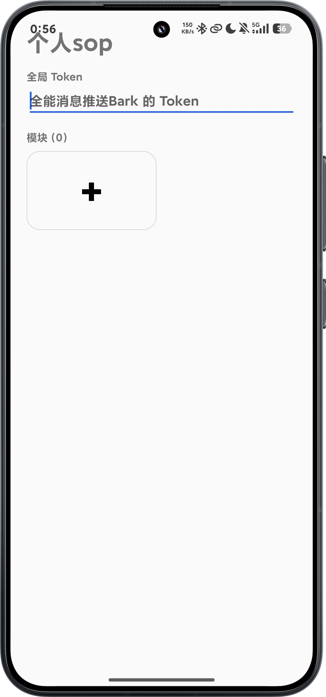
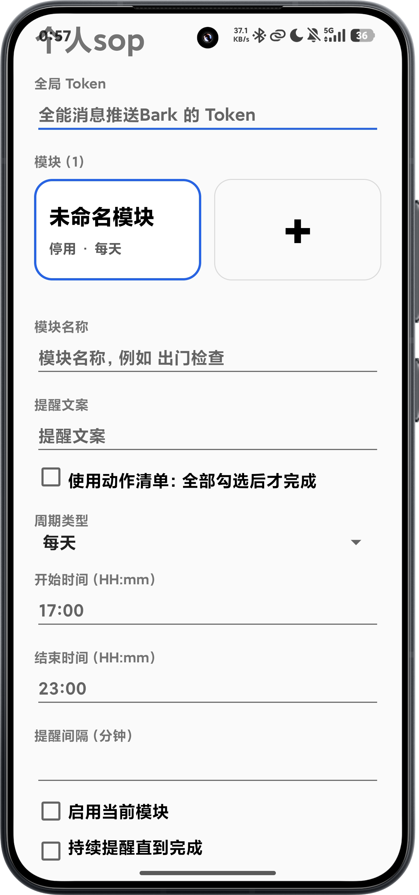
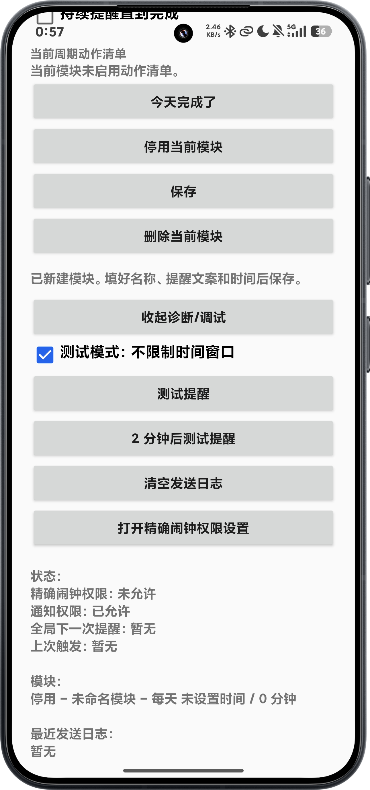

# 个人sop Android App

`个人sop` 是一个本地 Android APK，用来把容易拖延或遗忘的日常动作固定成 SOP。它按模块设置提醒周期、时间窗口和动作清单，通过 Android 精确闹钟唤醒并发送本地系统通知，再由手机通知同步到手环震动。

这个项目是个人工具，不包含账号、云同步、社区、统计打卡或复杂任务管理功能。

## 当前版本

- 最新版本：`v0.1.9`
- APK 下载：<https://github.com/LaFeai/personal-sop-android/releases/download/v0.1.9/personal-sop-debug.apk>
- 主要变化：提醒主链路从第三方 Bark 推送改为 App 本地 Android 通知，不再需要 Token、网络权限或第三方推送服务。

## 界面截图

<p align="center">
  
  
  
</p>

## 初始状态

公开版 APK 首次安装后不会内置任何个人模块：

- 不需要账号、Token 或第三方推送服务配置。
- 模块数量为 0。
- 首页只提供 `+` 添加入口。

## 通知链路

核心闭环：

```text
需要固定执行的动作
  -> App 按模块和周期安排系统精确闹钟
  -> 到点发送个人sop 本地系统通知
  -> 手机允许个人sop 通知
  -> 手机通知同步到手环震动
  -> 用户完成后在 App 中确认
  -> 当前周期停止提醒
```

当前主提醒链路不再使用 Bark 或其他第三方推送服务。提醒内容只用于本机 Android 通知；如果你开启了手环 App 的通知同步，手环会根据手机通知规则震动。

相比旧版 Bark 链路，本地通知链路减少了一个外部失败点：即使第三方推送服务 DNS、网络或接口不可用，系统闹钟触发后仍能由 `个人sop` 自己发出通知。

## 功能

- 通过 `+` 新建模块。
- 删除当前模块。
- 模块字段：
  - 模块名称
  - 提醒文案
  - 启用 / 停用（勾选启用，取消勾选停用）
  - 周期类型：每天 / 每周 / 每月 / 每隔N天
  - 每周提醒日
  - 每月第几个周几
  - 每隔N天的间隔天数和起始日期
  - 开始时间 / 结束时间
  - 提醒间隔
  - 使用动作清单
  - 测试模式
- 每天模式隐藏每周提醒日。
- 未启用动作清单时隐藏动作清单编辑框。
- 动作清单全部勾选后自动标记本周期完成。
- 使用动作清单时，完成入口就是清单全勾；未使用动作清单时，使用 `今天完成了` 按钮手动完成。
- 诊断/调试入口默认折叠。

## 时间窗口与提醒间隔

开始时间和结束时间定义提醒生效的时间窗口，提醒间隔定义这个窗口内重复提醒的频率。所有模块默认都会在时间窗口内持续提醒，不需要单独开启“持续提醒直到完成”。

例如时间窗口是 17:00-19:00，提醒间隔是 5 分钟，App 会在这个 2 小时窗口内按 5 分钟频率重复提醒，而不是只提醒一次。提醒会在用户点击“今天完成了”、动作清单全部勾选完成，或到达结束时间后停止。

## 固定天数间隔规则

“每隔N天”从起始日期开始计算，只按固定天数滚动。例如起始日期是 `2026-07-04`，间隔天数是 `10`，则允许日期是 `2026-07-04`、`2026-07-14`、`2026-07-24`。

这个规则不是自然月规则。比如“每隔两个月”如果先用 `60` 天表达，它会按 60 天滚动，并不保证落在两个月后的同一天；如果需要严格的“每隔 N 个自然月”，应作为后续独立周期类型实现。

## 月周期规则
每月周期按“第几个周几”设置，只支持第 1 个到第 4 个周一到周日，例如：

```text
每月第 3 个周六
每月第 4 个周五
```

App 不提供“第 5 个周几”或“最后一个周几”。原因是每个月一定有第 1 到第 4 个周一到周日，但不一定有第 5 个；为了让规则稳定、可预测，月底第 29 到 31 天附近可能出现的第 5 个周几会被有意舍去。需要安排月底事项时，请选择固定存在的第 4 个周几，或拆成单独提醒策略。

## 适合的 SOP 场景

适合 SOP 化的动作通常有这些特征：

- 重复发生。
- 做了有长期收益。
- 不做会慢慢变差。
- 每次临时决定会消耗意志力。
- 可以被拆成明确动作。

示例场景使用泛化描述，避免绑定任何人的真实习惯：

```text
示例：出门检查
- 周期：每天
- 时间窗口：出门前固定时间段
- 提醒方式：时间窗口内按间隔重复提醒，完成后停止
- 动作清单：钥匙、手机、钱包、门窗、电器

示例：周末整理
- 周期：每周
- 时间窗口：周末固定时间段
- 提醒方式：时间窗口内按间隔重复提醒，完成后停止
- 动作清单：桌面、垃圾、衣物、文件、补给品
```

## 构建环境

当前项目不是 Gradle 项目。它通过 `scripts/build-debug.ps1` 直接调用 Android SDK 命令行工具构建。

需要：

- Windows PowerShell
- Android Studio JBR
- Android SDK platform
- Android SDK build-tools
- Android SDK platform-tools

## 构建

在项目目录执行：

```powershell
powershell -ExecutionPolicy Bypass -File .\scripts\build-debug.ps1
```

输出 APK：

```text
build\personal-sop-debug.apk
```

## 安装

```powershell
& "$env:LOCALAPPDATA\Android\Sdk\platform-tools\adb.exe" install -r "build\personal-sop-debug.apk"
```

启动：

```powershell
& "$env:LOCALAPPDATA\Android\Sdk\platform-tools\adb.exe" shell am start -n com.codex.personalsop/.MainActivity
```

## 使用

1. 安装 APK。
2. 授予通知、精确闹钟等权限。
3. 点击 `+` 新建模块。
4. 编辑模块名称、提醒文案、周期和时间规则。
5. 按需要开启 `使用动作清单`。
6. 点击 `保存`。
7. 如果需要手环震动，请在小米运动健康等手环 App 中允许同步 `个人sop` 通知。

## 数据与隐私

- App 数据保存在本机 Android SharedPreferences。
- App 不做账号登录。
- App 不做云同步。
- App 不上传模块配置到项目作者或自有服务器。
- 发送提醒时，App 只在本机创建 Android 系统通知，不把提醒内容发送到第三方推送服务。
- 如果开启手环通知同步，手机系统和手环配套 App 会按其自身机制读取并转发通知内容。

## 已知限制

- 当前只提供本地 APK 和手动构建脚本。
- 当前没有 Gradle、CI、应用商店签名或自动发布流程。
- 当前依赖 Android 精确闹钟权限和厂商后台策略，部分手机系统可能需要额外允许自启动、后台运行和通知权限。
